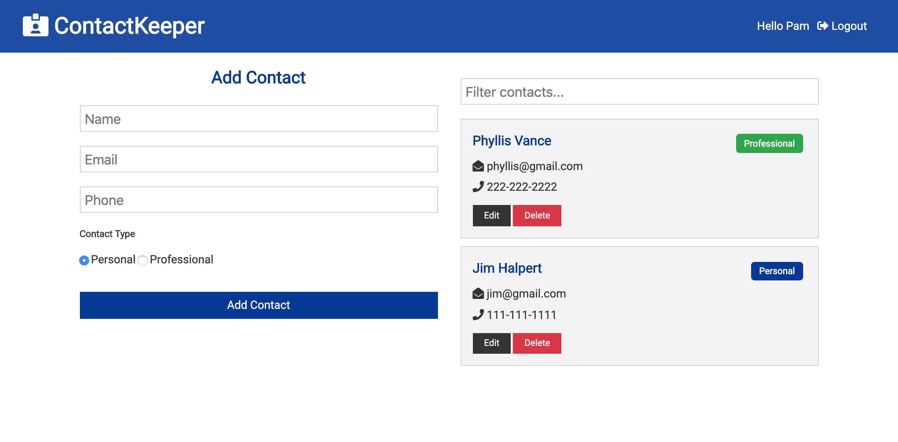

# idea-board

This is a MERN stack CRUD app that allows you to keep track of your contacts. Simply log in to see your list of personal and professional contacts. You can edit or delete any contacts, and of course add new ones. You can also search to filter through and find a specific contact quickly. Works well on both desktop and mobile!

Tech:
React with Context API,
Node,
MongoDB and Mongoose,
Express and Express-validator,
Bcrypt,
JWT,
Axios

### Check out the app yourself here!!

[ContactKeeper](https://contact-keeper-2019.herokuapp.com/)

## Screenshots

## License

[MIT](https://choosealicense.com/licenses/mit/)
